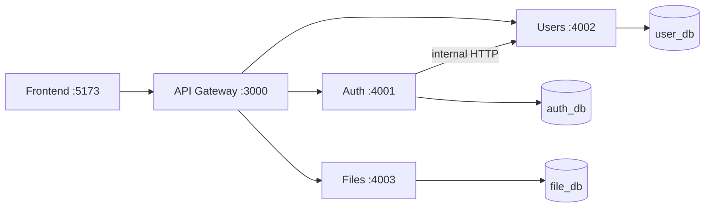

# Restful Microservices Template

Pure microservices REST platform: API gateway, domain services, shared libraries, and React frontend.

## Architecture



| Component | Port | Package |
|-----------|------|---------|
| API Gateway | 3000 | `@restful/gateway` |
| Auth Service | 4001 | `@restful/auth-service` |
| User Service | 4002 | `@restful/user-service` |
| File Service | 4003 | `@restful/file-service` |
| Shared domain lib | — | `@restful/shared` |
| HTTP/middleware lib | — | `@restful/service-kit` |

## Repository layout

```
packages/
  shared/          # JWT, errors, API types, service HTTP client
  service-kit/     # Express app factory, logging, validation middleware
services/
  gateway/         # Reverse proxy + aggregated health + Swagger UI
  auth-service/    # Credentials, tokens, email flows
  user-service/    # Profiles, roles, admin APIs + internal routes
  file-service/    # Uploads and file metadata
frontend/          # React + TanStack Query SPA
docker/            # Postgres init scripts
scripts/           # setup.mjs, e2e-test.mjs
```

## Quick start

```bash
npm run setup
npm run docker:up   # Postgres on localhost:55432
npm run db:migrate
npm run db:seed
npm run dev:all
```

In another terminal:

```bash
npm run dev:frontend
```

- Gateway API: http://localhost:3000/api/v1
- Swagger UI: http://localhost:3000/docs
- Default admin: `admin@example.com` / `Admin123!`

## Environment

Copy `.env.example` → `.env` in each service (or run `npm run setup`). Use the **same** values for:

- `JWT_ACCESS_SECRET` / `JWT_REFRESH_SECRET` (auth, users, files)
- `INTERNAL_SERVICE_KEY` (auth + users)

## Scripts

| Script | Description |
|--------|-------------|
| `npm run setup` | Install, build libs, generate Prisma clients, copy env files |
| `npm run dev:all` | Gateway + all services (concurrently) |
| `npm run db:migrate` | Migrate all service databases |
| `npm run db:seed` | Seed users then auth credentials |
| `npm run test:e2e` | HTTP smoke tests via gateway (services must be running) |
| `npm run docker:up` | Postgres with `auth_db`, `user_db`, `file_db` |

## Service boundaries

- **Auth**: passwords, refresh sessions, verification/reset tokens, Brevo email
- **Users**: profile data, roles, admin management; exposes `/internal/users` for auth
- **Files**: upload storage and metadata; authorizes via JWT claims
- **Gateway**: public entry only; does not expose internal routes

## Docker

```bash
docker compose up --build
```
